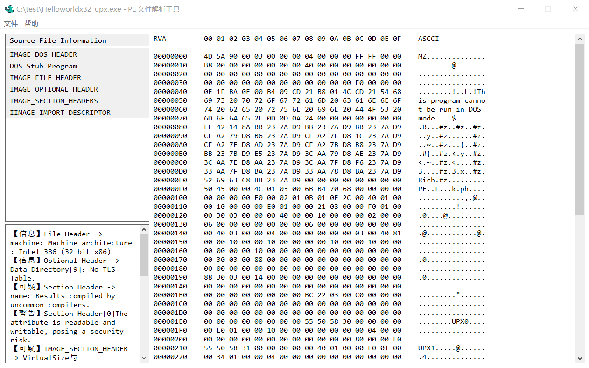
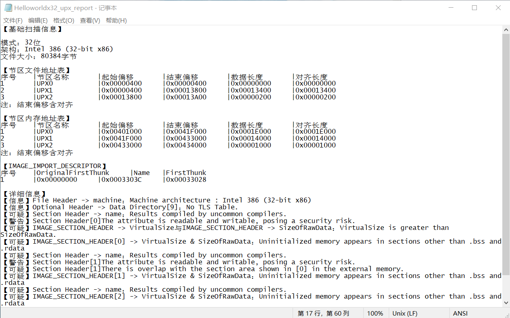

[Chinese](README.md) | [English](README.en.md)

# PE File Parsing Tool


A PE file analysis tool written in C++, focused on static file structure validation and security-assisted analysis.

Features: field-level structured output reports, lightweight file analysis,
average scan time < 2ms/file, GUI version maximum runtime memory < 15MB,
CLI version maximum runtime memory < 2MB (batch scanning), core components with no third-party dependencies and cross-platform support for Windows and Linux.

 **⚠️ Development Status**: Under development, with limited functionality. The API is in an iterative stage and is not yet stable.

## 📸 Program Preview




## ✨ Features

### ✅ Implemented Features
- **Basic file header data analysis**: Extracts information from IMAGE_DOS_HEADER to IMAGE_SECTION_HEADER and validates key fields
- **File export support**: Supports exporting parsing reports and hexadecimal source file data to TXT files
- **Interface design**: Develops a graphical user interface to improve user experience
- **Command-line version**: Supports batch file scanning and processing

### 🔄 Features in Development
- **Import table parsing**: The corresponding module exists but has not yet been integrated into the API
- **Routine maintenance**: Continuously supplementing the scan rule set, interface beautification, and content expansion, etc.

### 🚧 Planned Features
- **Export table parsing**: Extract and display the list of exported functions
- **AI-assisted extension**: Support JSON file export of parsing reports to assist AI parsing

## 🚀 Quick Start

### Environment Requirements
- Windows 10/11 operating system
- A compiler supporting C++17 (Visual Studio 2022 / MinGW / Clang)
- CMake 3.15 or higher

### Build and Run

#### Windows

1. Clone the project and open the CMake project:
   ```bash
   git clone https://github.com/Calparrot/PE-ParsingTool.git
   cd PE-ParsingTool
   ```

2. Use Visual Studio to open the project root directory (**File → Open → CMake**), and select `CMakeLists.txt`.
   > VS will automatically recognize the CMake project, so there is no need to manually generate a `.sln` file.

3. At the top of Visual Studio, select the build configuration (**Debug / Release**), then:
   - Right-click `CMakeLists.txt` → **Build**
   - Or press `Ctrl + Shift + B` to compile directly

4. After compilation is complete, the executable files are generated in:
   ```bash
   out/build/x64-Debug/PE_ParsingTool.exe      # GUI version
   out/build/x64-Debug/PE_ParsingTool_cli.exe  # CLI version
   ```

> 💡 **If using the command line + CMake** (without relying on the VS interface):
> ```bash
> cmake -B build
> cmake --build build --config Release
> ```
> Generated in the `build/Release/` directory.

#### Linux (Command Line)

```bash
git clone https://github.com/Calparrot/PE-ParsingTool.git
cd PE-ParsingTool
cmake -B build -DCMAKE_BUILD_TYPE=Release
cmake --build build -j$(nproc)
```

Run the CLI version:
```bash
./build/PE_ParsingTool_cli
```

#### GUI Version Usage Instructions
1. Click the menu bar → File → Open
2. After selecting a file, click items in the left navigation bar to display detailed information
3. To export, click the menu bar → File → Export, and select the desired format

#### Command-Line Version Usage Instructions
1. Use `<tool name> -h` or `<tool name> --help` to view usage instructions

## 📖 Programming Interface (API)

The core interface is defined in [`core/core_include/api.h`](core/core_include/api.h)
### Quick Example

```cpp
#include "api.h"
#include <iostream>

int main() {
    // Create an analysis object, call the analysis function, and pass in the file path
    FundamentalAnalysis object;
    FundamentalAnalysis::error_code result = object.analysis_file("C:/test.exe");
    
    // Export the analysis report
    if (result == FundamentalAnalysis::error_code::SUCCESS) {          
        object.do_scan_txt_export("C:/output.txt");
        std::cout << "Analysis complete, report exported." << std::endl;
    }
    return 0;
}
```

### Core Type Description
| Type | Description |
|------|-------------|
| `FundamentalAnalysis` | Core analysis class, providing file analysis functionality and result management interfaces |
| `FundamentalAnalysis::error_code` | Error code type, representing the analysis result status |
| `data_manager` | A public member of `FundamentalAnalysis`, responsible for report export and data management |

### Main Methods
| Function | Return Value | Description |
|--------|--------------|-------------|
| `analysis_file(const std::string& path)` | `error_code` | Analyzes the PE file at the specified path and returns an error code based on whether the analysis succeeds |
| `summary_file()` | `ScanResultsDistribution` | Summarizes a single analysis result and returns the analysis report data (without printing) |
| `do_scan_txt_export(const std::string& path)` | `bool` | Exports the analysis report to the specified path |
| `do_hexadecimal_export(const std::string& path)` | `bool` | Exports hexadecimal view data to the specified path |
| `data_manager.print_report()` | `void` | Prints a single analysis report to the console |

> Note: Except for `analysis_file`, all other methods must be called after `analysis_file` succeeds (returns `0`).

## 📁 Project Structure
```text
PE-ParsingTool/
├── CMakeLists.txt                  # CMake build configuration
├── CMakeSettings.json              # Visual Studio CMake configuration
├── core/ # Core parsing module (cross-platform)
│   ├── core_include/               # Header files
│   └── core_src/                   # Source files
├── gui/ # GUI module (Windows only)
│   ├── gui_include/                # Header files
│   └── gui_src/                    # Source files
├── cli/ # Command-line module (cross-platform)
│   ├── cli_include/                # Header files
│   └── cli_src/                    # Source files
├── resources/ # Resource folder
│   ├── icons/                      # Icon resources
│   ├── PE_ParsingTool.exe.manifest # Program manifest file
│   ├── PE_ParsingTool.rc           # Resource file
│   └── resource.h                  # Resource definitions
├── docs/ # Documentation
│   ├── images/                     # Example images
│   └── ARCHITECTURE.md             # Architecture design document
├── tests/ # Tests
│   └── samples/                    # Test samples
├── README.md                       # Project description Chinese version (default)
├── README.en.md                    # Project description English version
└── LICENSE.txt                     # License file
```

## ⚠️ Known Issues and Limitations
**File Format and Platform Limitations**
- ROM images in the PE file specification are not currently supported
- Running on big-endian platforms is not supported
- No file format validation was performed; passing in other files will not stop the parsing, resulting in a large amount of invalid data in the parsing report.
- Very small files (< 1KB) may not be supported.

**Parsing Limitations**
- Some debug information blocks are similar to section header structures at the binary level, and the current version may mistakenly identify them as valid section header information. This may cause sections that do not actually exist to appear in the parsing report.
- The current section name whitelist mainly covers standard sections and is prone to false positives for legitimate section names under specific compilers or debugging environments (such as `.debug$T`, `.fptable`, etc.)
- File format-specific parsing is not strong and is mainly based on the `.exe` format. Differences in some parts of different formats under the PE file specification (such as `.dll`, `.sys`, etc.) will cause false positives

**Display and Performance**
- The hexadecimal viewing function of the GUI version is incomplete. If needed, you can choose to export the "hexadecimal view" in the GUI version for viewing
- The CLI version does not yet fully support Chinese paths (UTF-8 encoded paths)
- There is a GBK encoding display garbled text issue on the Linux platform

**Other**
- The project is in the development stage, and the API is unstable, so usage instructions are not yet provided
- The two files under the core folder named database have nothing to do with a database; they are named this way because they define the structures and related operations for core result storage
- The PE file samples used to test this project are relatively limited, so test results may have deviations
- Other unknown issues are not supported :(