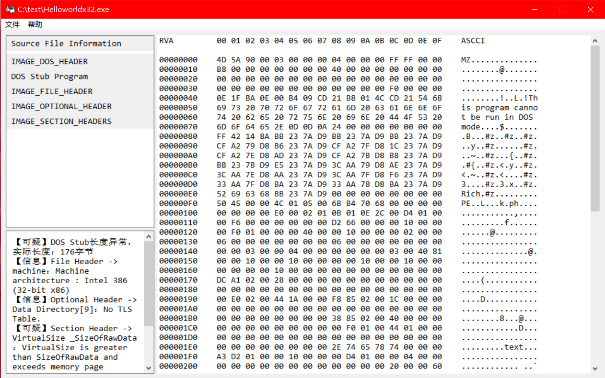

# PE ParsingTool


一个用 C++ 编写的 PE 文件分析工具，专注于安全分析、格式验证与查看。
特色：具体到字段的输出报告，轻量级单文件分析，核心组件无第三方依赖、可跨平台。

 **⚠️ 开发状态**：这是一个个人在学习 PE 格式和逆向工程时写的小项目，正在积极开发中，功能不完整。

 ## 📸 程序预览



## ✨ 功能特性

### ✅ 已实现的功能
- **DOS头基础解析**：提取 DOS 头信息并进行关键字段验证
- **DOS存根数据提取**：提取 DOS 存根数据
- **文件头基础解析**：提取文件头信息并进行关键字段验证
- **可选头基础解析**：支持 32 位和 64 位 PE 文件的可选头关键字段验证

### 🔄 正在开发的功能
- **节区头基础解析**：提取可能的节区头并进行关键字段验证
- **支持导出文件**：支持解析报告、十六进制源文件数据的 TXT 文件导出
- **界面设计**：开发图形用户界面，提升用户体验

### 🚧 计划中的功能
- **完善反推检验**：增强各头部字段的反推检验功能
- **导入表解析**：提取并显示导入的 DLL 和函数
- **导出表解析**：提取并显示导出的函数列表
- **AI辅助扩展**：将扫描结果转化为 AI 可识别的特征模式，辅助 AI 解析

## 🚀 快速开始

### 环境要求
- Windows 10/11 操作系统
- 支持 C++17 的编译器（Visual Studio 2022 / MinGW / Clang）
- CMake 3.15 或更高版本

### 编译运行

#### 使用命令行（推荐）
```bash
# 克隆项目
git clone https://github.com/Calparrot/PE-ParsingTool.git
cd PE-ParsingTool

# 配置并编译
cmake -B build -G Ninja
cmake --build build

# 运行程序
./build/PE_ParsingTool.exe

## 📁 项目结构
```text
PE-ParsingTool/
├── CMakeLists.txt          # CMake 构建配置
├── README.md               # 项目说明
│
├── core/                   # 核心解析模块（跨平台）
│   ├── core_include/       # 头文件
│   │   ├── api.h           # 对外接口
│   │   ├── database.h      # 数据结构定义
│   │   ├── diagnostic_codes.h  # 诊断错误码
│   │   └── peanalyzer.h    # PE解析器核心类
│   └── core_src/           # 源文件
│       ├── api.cpp
│       ├── database.cpp
│       ├── diagnostic_helpers.cpp
│       └── peanalyzer.cpp
│
├── gui/                    # GUI 模块（Windows 专用）
│   ├── gui_include/        # 头文件
│   │   ├── custom_message.h
│   │   ├── translator.h
│   │   └── utils.h
│   └── gui_src/            # 源文件
│       ├── translator.cpp
│       ├── utils.cpp
│       └── winmain.cpp     # 程序入口
│
├── icons/                  # 图标资源
│   └── myicon.ico
├── images/                 # 示例图片
│   └── cxyxsl.png
└── resource.h              # 资源定义
```

## ⚠️ 已知问题与限制

### 使用说明
1. 点击菜单栏 → 文件 → 打开
2. 选择文件后，单击左侧导航栏项目以显示详细信息
3. 需要导出时，点击菜单栏 → 文件 → 导出，选择需要的格式

### 已知问题

**文件格式限制**
- 未做文件验证，请不要传入除 `.exe`、`.dll` 以外的文件，传入其他格式会导致扫描结果异常
- 不支持 ROM 格式
- 不支持大端序

**解析限制**
- 不支持调试伪节区扫描
- 节区名白名单不全，容易误报合法节区名

**显示与性能**
- 十六进制显示不全，不支持浏览器模式，有需要可选择导出后查看
- 可能不支持大文件（缺少大文件测试）

**其他**
- 不支持其他未知问题 (ˉ▽ˉ ;)