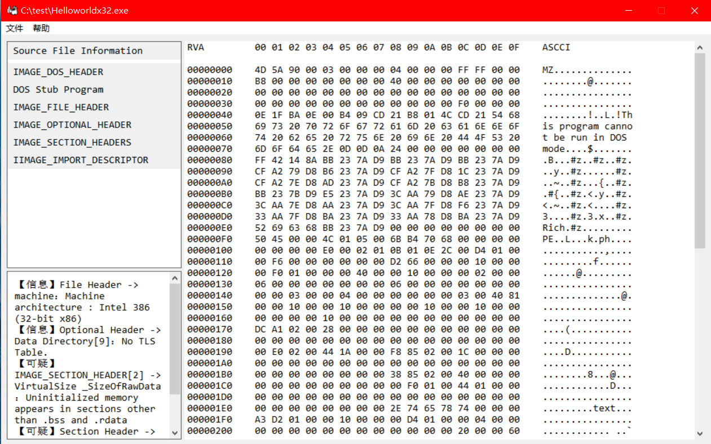

[中文](README.md) | [English](README.en.md)

# PE ParsingTool


一个用 C++ 编写的 PE 文件分析工具，专注于安全分析、结构验证与查看。

特色：具体到字段的结构输出报告，轻量级文件分析，
平均扫描耗时 < 2ms/文件，GUI版本最高运行内存小于15MB，
CLI版本最高运行内存小于2MB（批量扫描），核心组件无第三方依赖、可跨 Windows、Linux 平台。

 **⚠️ 开发状态**：开发中，功能有限。API 处于早期迭代阶段，目前尚未稳定。

## 📸 程序预览



## ✨ 功能特性

### ✅ 已实现的功能
- **文件头部基础数据分析**：提取 IMAGE_DOS_HEADER 至 IMAGE_SECTION_HEADER 信息并进行关键字段验证
- **支持导出文件**：支持解析报告、十六进制源文件数据的 TXT 文件导出
- **界面设计**：开发图形用户界面，提升用户体验

### 🔄 正在开发的功能
- **导入表解析**：提取导入的 DLL 和函数
- **命令行版本**：支持批量文件扫描处理
- **日常维护**：持续补充扫描规则集、界面美化和内容补充等

### 🚧 计划中的功能
- **导出表解析**：提取并显示导出的函数列表
- **AI辅助扩展**：支持解析报告的 JSON 文件导出，辅助 AI 解析

## 🚀 快速开始

### 环境要求
- Windows 10/11 操作系统
- 支持 C++17 的编译器（Visual Studio 2022 / MinGW / Clang）
- CMake 3.15 或更高版本

### 编译与运行

#### Windows

1. 克隆项目并打开 CMake 工程：
   ```bash
   git clone https://github.com/Calparrot/PE-ParsingTool.git
   cd PE-ParsingTool
   ```

2. 使用 Visual Studio 打开项目根目录（**文件 → 打开 → CMake**），选择 `CMakeLists.txt`。
   > VS 会自动识别 CMake 工程，无需手动生成 `.sln` 文件。

3. 在 Visual Studio 顶部选择构建配置（**Debug / Release**），然后：
   - 右键 `CMakeLists.txt` → **生成**
   - 或按 `Ctrl + Shift + B` 直接编译

4. 编译完成后，可执行文件生成在：
   ```bash
   out/build/x64-Debug/PE_ParsingTool.exe      # GUI 版本
   out/build/x64-Debug/PE_ParsingTool_cli.exe  # CLI 版本
   ```

> 💡 **如果使用命令行 + CMake**（不依赖 VS 界面）：
> ```bash
> cmake -B build
> cmake --build build --config Release
> ```
> 生成在 `build/Release/` 目录下。

#### Linux（命令行）

```bash
git clone https://github.com/Calparrot/PE-ParsingTool.git
cd PE-ParsingTool
cmake -B build -DCMAKE_BUILD_TYPE=Release
cmake --build build -j$(nproc)
```

运行 CLI 版本：
```bash
./build/PE_ParsingTool_cli
```

#### GUI版本使用说明
1. 点击菜单栏 → 文件 → 打开
2. 选择文件后，单击左侧导航栏项目以显示详细信息
3. 需要导出时，点击菜单栏 → 文件 → 导出，选择需要的格式

#### 命令行版本使用说明
1. 使用 `<工具名> -h` 或 `<工具名> --help` 查看使用说明

## 📖 编程接口（API）

核心接口定义在 [`core/core_include/api.h`](core/core_include/api.h)
### 快速示例

```cpp
#include "api.h"
#include <iostream>

int main() {
    FundamentalAnalysis object; // 创建分析对象
    FundamentalAnalysis::error_code result = object.analysis_file("C:/test.exe");
                                // 调用分析函数，传入文件路径
    
    if (result == 0) {          // 导出分析报告
        object.data_manager.scan_report_export("C:/output.txt");
        cout << "分析完成，报告已导出。" << endl;
    }
    return 0;
}
```

### 核心类型说明
| 类型 | 描述 |
|------|-------------|
| `FundamentalAnalysis` | 核心分析类，提供文件分析功能和结果管理接口 |
| `FundamentalAnalysis::error_code` | 错误码类型，表示分析结果状态 |
| `data_manager` | `FundamentalAnalysis` 的公开成员，负责报告导出和数据管理 |

### 主要方法
| 函数 | 返回值 | 描述 |
|--------|--------------|-------------|
| `analysis_file(const std::string& path)` | `error_code` | 分析指定路径的 PE 文件，根据分析成功与否返回错误码 |
| `summary_file()` | `ScanResultsDistribution` | 汇总单次分析结果，返回分析报告数据（不打印） |
| `data_manager.scan_report_export(const std::string& path)` | `bool` | 导出分析报告到指定路径 |
| `data_manager.hexadecimal_document_export(const std::string& path)` | `bool` | 导出十六进制视图数据到指定路径 |
| `data_manager.print_report()` | `void` | 打印单次分析报告到控制台 |

> 注意：除 `analysis_file` 外，其他方法均需在 `analysis_file` 成功（返回 `0`）后调用。

## 📁 项目结构
```text
PE-ParsingTool/
├── CMakeLists.txt # CMake 构建配置
├── CMakeSettings.json # Visual Studio CMake 配置
├── README.md # 项目说明中文版（默认）
├── README.en.md # 项目说明英文版
├── LICENSE.txt # 许可证文件
│
├── core/ # 核心解析模块（跨平台）
│   ├── core_include/ # 头文件
│   │   ├── api.h # 对外接口
│   │   ├── database.h # 核心结果存储定义
│   │   ├── diagnostic_codes.h # 诊断错误码
│   │   ├── peanalyzer.h # PE解析器核心类
│   │   ├── recheck.h # PE解析器细扫规则定义
│   │   └── recheck_data.h # 细扫结果存储定义
│   └── core_src/ # 源文件
│       ├── api.cpp
│       ├── database.cpp
│       ├── diagnostic_helpers.cpp
│       ├── peanalyzer.cpp
│       ├── recheck.cpp
│       └── recheck_data.cpp
│
├── gui/ # GUI 模块（Windows 专用）
│   ├── gui_include/ # 头文件
│   │   ├── custom_message.h # 自定义消息定义
│   │   ├── translator.h # 格式转换类定义
│   │   └── utils.h # 工具函数定义
│   └── gui_src/ # 源文件
│       ├── translator.cpp
│       ├── utils.cpp
│       └── winmain.cpp # 程序入口
│
├── cli/ # 命令行模块（跨平台）
│   ├── cli_include/ # 头文件
│   │   └── functions.h # 工具函数定义
│   └── cli_src/ # 源文件
│       ├── functions.cpp
│       └── main_cli.cpp # 命令行程序入口
│
├── icons/ # 图标资源
│   └── myicon.ico
├── images/ # 示例图片
│   └── guiout.png
├── PE_ParsingTool.rc # 资源文件
└── resource.h # 资源定义
```

## ⚠️ 已知问题与限制
**文件格式和平台限制**
- 暂不支持解析 PE 文件规范中的 ROM 镜像
- 不支持大端序平台上运行
- 未做文件格式验证，传入其他格式会按照PE格式扫描原始二进制数据格式解析

**解析限制**
- 部分调试信息块在二进制层面与节区头结构相似，当前版本可能将其错误识别为有效节区头信息。这可能导致解析报告中出现实际不存在的节区。
- 当前节区名白名单主要覆盖标准节区，容易误报特定编译器或者调试环境下的合法节区名（如`.debug$T`、`.fptable`等）
- 文件格式特异性解析不强，主要以`.exe`格式为准，PE文件下不同格式（如`.dll`、`.sys`等）的部分差异会导致误报

**显示与性能**
- GUI版本的十六进制查看功能不全，有需要可以在GUI版本下选择导出“十六进制视图”查看
- CLI版本暂不完全支持传入中文路径（utf-8编码路径）

**其他**
- 项目处于开发阶段，API不稳定，因此暂未给出使用说明
- core 文件夹下的叫 database 的两个文件和数据库没有关系，叫这个名字是因为它们定义了核心结果存储的结构和相关操作
- 用于测试本项目的 PE 文件样本较为有限，各项测试结果可能存在偏差
- 不支持其他未知问题 :(